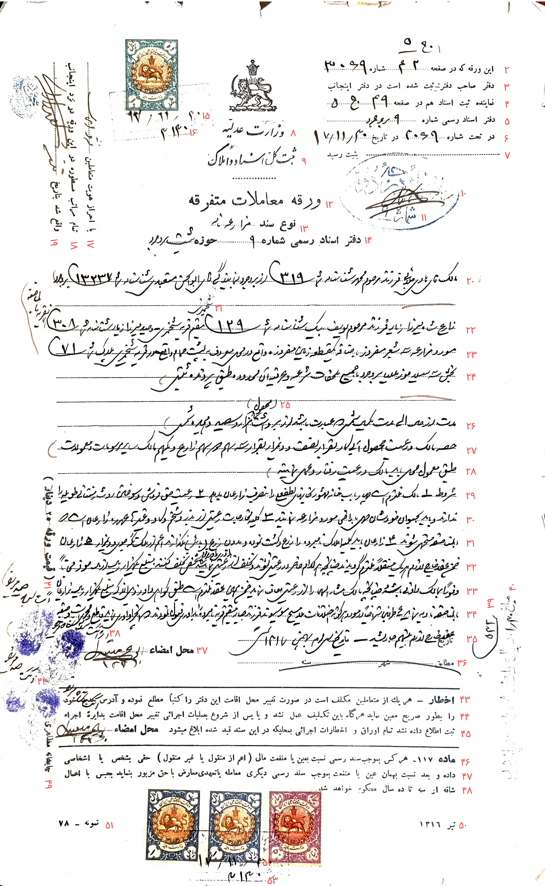

**شماره سند: ۰۰۱**

**نوع سند:** مزارعه نامه

**تاریخ سند:** سی‌ام بهمن ماه هزار و سیصد و هفده (۱۳۱۷/۱۱/۳۰)

--------------------------

متن سند:

سطر ۱: ج ۵

سطر ۲: این ورقه که در صفحه ۴۲ شماره ۳۰۶۹

سطر ۳ : دفتر صاحب دفتر ثبت شده است در دفتر اینجانب

سطر ۴: نماینده ثبت اسناد هم در صفحه ۴۹ ج ۵

سطر ۵: دفتر اسناد رسمی شماره ۹ بروجرد

سطر ۶: در تحت شماره ۳۰۶۹ در تاریخ ۱۷/۱۱/۳۰

سطر ۷: .......................... بثبت رسید

سطر ۸: وزارت عدلیه

سطر ۹: ثبت کل اسناد و املاک

سطر ۱۰: ؟؟؟ ؟؟؟ بروجرد و(؟) درود(؟)

سطر ۱۱: شماره ۹

سطر ۱۲: ورقه معاملات متفرقه

سطر ۱۳: نوع سند مزارعه نامه

سطر ۱۴: دفتر اسناد رسمی شماره ۹ حوزه ثبت بروجرد

سطر ۱۵: ۱۷/۱۱/۳۰

سطر ۱۶: ۳۱۳۰

سطر ۱۷: با احراز هویت متعاملین ؟؟؟ ؟؟؟

سطر ۱۸: تمام مراتب مسطوره در این ورقه در نزد اینجانب 

سطر ۱۹: واقع شد بتاریخ ؟؟؟

سطر ۲۰: مالک آقای(؟) هادی جلائی فرزند مرحوم محمد شناسنامه شماره(؟) ۳۱۹ از بروجرد به نمایندگی آقای ابوالحسن معتمدی(؟) شناسنامه شماره(؟) ۱۳۲۳۷ بروجرد

سطر ۲۱: شیخمیری(؟)

سطر ۲۲: زارع شاه میرزا زیار(؟) فرزند مرحوم یوسف بیک شناسنامه شماره ۱۲۹ مقیم قریه شیخمیری - و صید میرزا زیار(؟) شناسنامه شماره ۳۰۸ ؟؟؟ ؟؟؟

سطر ۲۳: مورد مزارعه سه شعیر مفروز ؟؟؟ یکقطعه زمین مفروزه واقع در محلی معروف به پشت حمام واقع در قریه شیخمیری پلاک شماره ۷۱

سطر ۲۴: بخش سه سیلاخور علیا بروجرد با جمیع ملحقات شرعیه و عرفیه آن محدوده طبق پرونده ثبتی )

سطر ۲۵: (محصول)

سطر ۲۶: مدت از ؟؟؟ الی ؟؟؟ ؟؟؟ شمسی عبارت باشد از برداشت هزار و سیصد و هجده شمسی )

سطر ۲۷: حصه(؟) مالک و رعیت محصول آبی(؟) ؟؟؟ بقرار نصف و ؟؟؟ بقرار سه سهم ؟؟؟ سهم زارع ویکسهم مالک سایر مرسومات و معمولات ) 

سطر ۲۸: طبق معمول محلی باید مالک و رعیت رفتار و عمل نمایند )

سطر ۲۹: شروط ۱ مالک ملزم است چهار باب خانه مهشور [مشهور] ؟؟؟ لطفعلی را ؟؟؟ زارعان بدهد ۲ رعیت حق فروش و سوختن روث و ؟؟؟ طویله را 

سطر ۳۰: ندارند و باید بحیوان خودشان ؟؟؟ ؟؟؟ ؟؟؟ مورد مزارعه نمایند ۳ کلیه مخارجات رعیتی از بزر و شخم و ؟؟؟ غیر ها(؟) عهده زارعان است

سطر ۳۱: ؟؟؟ ؟؟؟ متعد(؟) شوند ۴ زارعان باید کلیه املاک نامبرده را زرع و کشت نموده و بدون زرع (بائر) اعم از ملک ؟؟؟ ؟؟؟ و(؟) ؟؟؟ ۵ زارعان 

سطر ۳۲: ضمن(؟) عقد خارج از ؟؟؟ هریک مستقلاَ ملزم گردیدند چنانچه هرکدام حاضر ؟؟؟ شوند و تخلف از رعیتی نمایند /بداوری داور مرقوم/ شخص تخلف کننده مبلغ یکهزار ریال ؟؟؟ ؟؟؟ ؟؟؟ 

سطر ۳۳: و فوراَ بمالک ؟؟؟ باشد و چنانچه مالک مشارالیه را از رعیتی معاف نماید ؟؟؟ ؟؟؟ عقد ملزم است طبق کواهی [گواهی] داور ؟؟؟ ؟؟؟ مبلغ یکهزار ریال ؟؟؟ ؟؟؟ 

سطر ۳۴: ؟؟؟ ؟؟؟ نماید ۶ ؟؟؟؟ ؟؟؟؟ احیاناَ در مورد هرگونه اختلاف ؟؟؟ ؟؟؟ موسیوند فرزند جبار(؟) مقیم قریه نامبرده را بداوری قبول نمودند ؟؟؟ ؟؟؟ داوری نماید قاطع ؟؟؟ ؟؟؟

سطر ۳۵: تاریخ عقد خارج از ؟؟؟ ؟؟؟ جاریشد - تاریخ سی ام بهمن ۱۳۱۷ شمسی

سطر ۳۶: مطابق ........... شهر .................. سنه ...............

سطر ۳۷: محل امضاء ابو؟؟؟ ؟؟؟

سطر ۳۸: اثر انگشت

سطر ۳۹: ۵۳۲

سطر ۴۰: مبلغ ۱/۳۰ ریال عوارض شهرداری دریافت شد

سطر ۴۱: (قیمت ورقه ۲۵(؟) دینار)

سطر ۴۲: ؟؟؟ ؟؟؟ ؟؟؟

سطر ۴۳: اخطار - هر يك از متعاملین مکلف است در صورت تغییر محل اقامت این دفتر را کتباً مطلع نموده و آدرس صحیح جدید خود

سطر ۴۴: را بطور صریح معین نماید هر گاه باین تکلیف عمل نشد و یا پس از شروع بعملیات اجرائی تغییر محل اقامت بدایره اجراء

سطر ۴۵: ثبت اطلاع داده نشد تمام اوراق و اخطارات اجرائی بمحلیکه در این سند قید شده ابلاغ میشود محل امضاء ؟؟؟

سطر ۴۶: ماده ۱۱۷- هر کس بموجب سند رسمی نسبت بعین یا منفعت مالی (اعم از منقول یا غیر منقول) حقی بشخص یا اشخاصی

سطر ۴۷: داده و بعد نسبت بهمان عین یا منفعت بموجب سند رسمی دیگری معامله یا تعهدی معارض با حق مزبور بنماید بحبس با اعمال

سطر ۴۸: شاقه از سه تا ده سال محکوم خواهد شد

سطر ۴۹: چاپخانه مظاهری

سطر ۵۰: تیر ۱۳۱۶

سطر ۵۱: نمونه - ۷۸

سطر ۵۲: ۱۷/۱۱/۳۰

سطر ۵۳: ۳۱۳۰

